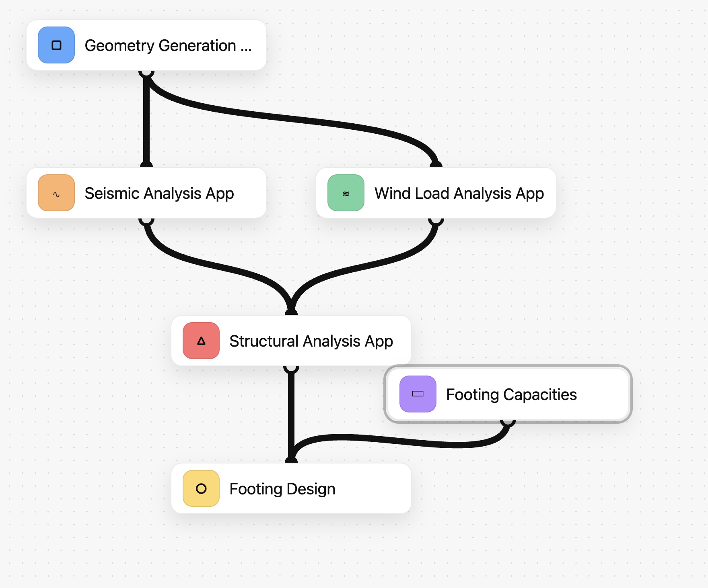

## Workflow graph visualizer

Generates a single self-contained HTML file (no server) that renders a workflow DAG.



### Run the example

```bash
uv sync
uv run python -m workflow_graph.example_workflow
```

This writes `workflow_graph/index.html` and opens it in your browser.
